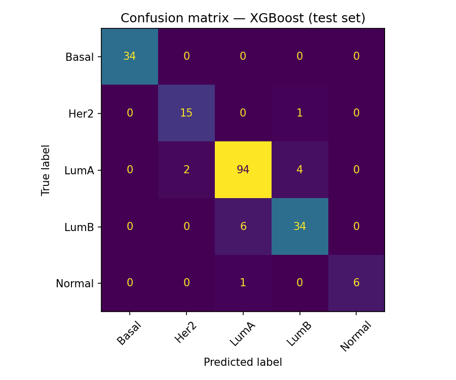
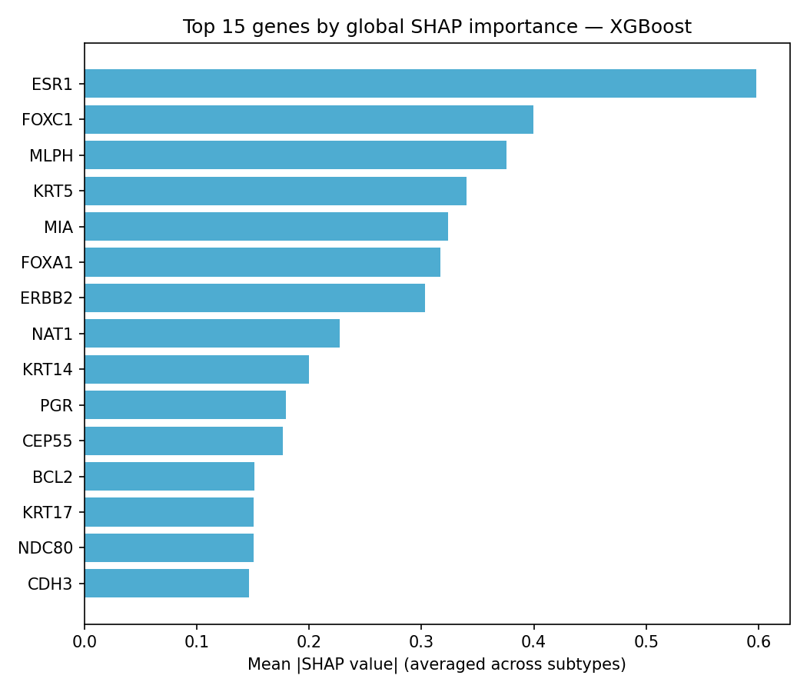

# ML-Based Prediction of Breast Cancer Treatment Subtype from Gene Expression Data


**Live API:** [tcga-brca-subtype-classifier.onrender.com/docs](https://tcga-brca-subtype-classifier.onrender.com/docs) — interactive Swagger UI, try `/predict` directly in the browser. Deployed on Render's free tier, so it spins down after inactivity; the first request after a period of idle time can take up to ~50 seconds while it wakes up.

## The Problem

Breast cancer isn't one disease. This project predicts which of 5 breast cancer subtypes (PAM50: Luminal A, Luminal B, HER2-enriched, Basal-like, Normal-like) a tumor has, using gene expression data — the subtype is what determines whether a patient receives hormone therapy, targeted therapy, or chemotherapy. It's a real clinical decision-support task, built on public patient data (981 patients, TCGA-BRCA), not a synthetic benchmark.

**This project frames subtype prediction as a supervised multi-class classification problem: three models (Logistic Regression, Random Forest, XGBoost) are compared via cross-validation, the best one is interpreted with SHAP, and it's deployed end-to-end as a live REST API. It classifies patients with 93% accuracy on held-out test data — and, using no prior medical knowledge, independently ranks ESR1 (the estrogen receptor) as its top predictive feature, the same gene oncologists already rely on to guide treatment.**

---

## Results

- **93% accuracy** on held-out test data (981 patients, 80/20 stratified split), best model: **XGBoost** (F1-macro 0.86, 91% mean accuracy across 5-fold cross-validation).
- Chosen after comparing 3 candidate models under identical cross-validation folds and identical class-imbalance handling (per-sample weighting), so the comparison isn't confounded by each model handling imbalance differently.
- **Interpretability:** without being told anything about cancer biology, the model's top-ranked predictive gene was **ESR1** (estrogen receptor) — the same gene oncologists use to decide whether a patient receives hormone therapy. **ERBB2** (HER2, target of trastuzumab) also ranked in the top 10.

**Model comparison (5-fold cross-validation, mean scores):**

| Model | Accuracy | F1-macro | ROC-AUC (OvR) |
|---|---|---|---|
| Logistic Regression | 0.83 | 0.78 | 0.96 |
| Random Forest | 0.90 | 0.81 | 0.99 |
| **XGBoost (best)** | **0.91** | **0.86** | **0.99** |

| Test set performance | Feature importance (SHAP) |
|---|---|
|  |  |

---

## Pipeline

1. **Data acquisition, QC & EDA** — clinical (PAM50 subtype) + gene expression data for TCGA-BRCA, pulled from cBioPortal's public API; PCA, gene correlation structure, and marker-gene checks by subtype.
2. **SQL layer** — processed data loaded into a relational database; cohort and feature-set queries run in SQL, then passed to pandas for modeling.
3. **Modeling** — Logistic Regression, Random Forest, and XGBoost compared via cross-validation (accuracy, F1, ROC-AUC).
4. **Interpretability** — SHAP values on the best model, cross-checked against known breast-cancer subtype biology (e.g. ESR1, ERBB2, MKI67).
5. **API** — FastAPI endpoint serving the trained model (patient features in → subtype prediction out).
6. **Deployment** — Dockerized and deployed to Render (free tier).

**On feature selection:** the feature set is the 50-gene PAM50 panel rather than the full transcriptome (~20,000 genes) — a clinically-validated gene panel established through prior research as optimally discriminative for these subtypes. Using it *is* the feature selection step, done through domain knowledge rather than re-derived statistically from scratch.

---

## Repository Structure

```
breast-cancer-subtype-predictor/
├── data/                     # Raw and processed data (clinical + expression)
├── notebooks/
│   ├── 01_data_acquisition_qc.ipynb
│   ├── 02_modeling_cross_validation.ipynb
│   └── 03_shap_interpretability.ipynb
├── api/                      # FastAPI app, trained model bundle, test scripts
├── examples/
│   └── sample_patients.csv   # 5 real patients (one per subtype), ready to upload to POST /predict/csv
├── figures/
├── Dockerfile
├── requirements.txt
└── README.md
```

## Notebooks

| # | Notebook | Status | Description |
|---|---|---|---|
| 01 | `01_data_acquisition_qc.ipynb` | ✅ Complete | Pull PAM50 clinical annotations + expression data from cBioPortal; QC, EDA (PCA, gene correlation, marker genes); load into SQL and assemble the modeling cohort via SQL query |
| 02 | `02_modeling_cross_validation.ipynb` | ✅ Complete | Compare Logistic Regression, Random Forest, and XGBoost via cross-validation (XGBoost best: F1-macro 0.86, accuracy 91%), evaluate the best model on the held-out test set (93% accuracy), export it for the API |
| 03 | `03_shap_interpretability.ipynb` | ✅ Complete | SHAP-based model interpretation (TreeExplainer), global feature ranking, biological cross-validation against ESR1/ERBB2/MKI67, single-prediction explanation |

---

## Data Source

**cBioPortal for Cancer Genomics** (public API, no authentication required): [www.cbioportal.org](https://www.cbioportal.org) — study: TCGA, Breast Invasive Carcinoma (BRCA), PanCancer Atlas.

Underlying data originates from **The Cancer Genome Atlas (TCGA)**, a public resource of the National Cancer Institute and National Human Genome Research Institute.

---

## How to Run

**Notebooks** are designed to run in Google Colab (each one prompts for the required input files via an upload dialog — no local setup needed). Open them directly from the `notebooks/` folder on GitHub, or upload them to [colab.research.google.com](https://colab.research.google.com).

**API, locally:**
```bash
git clone https://github.com/virginiagalvan/breast-cancer-subtype-predictor.git
cd breast-cancer-subtype-predictor
pip install -r requirements.txt
cd api
uvicorn main:app --reload
```
Then open `http://127.0.0.1:8000/docs` for the interactive API docs.

**API, with Docker:**
```bash
docker build -t breast-cancer-subtype-predictor .
docker run -p 8000:8000 breast-cancer-subtype-predictor
```

---

## Author

Virginia Galván – [LinkedIn](https://www.linkedin.com/in/virgina-galvan-390ba233b/)

